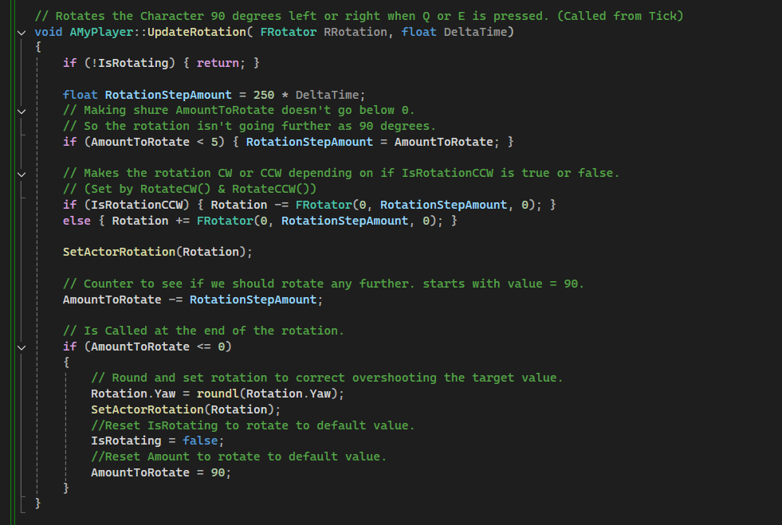

# Unreal-Engine-Capstone
In this project I present the game that I made as Capstone Project for the C++ and Unreale Engine Course from [The Tech Academy](https://www.learncodinganywhere.com/) Game Developer Boot Camp.
The Project was setup to stimulate a real job project as much as possible. Therefor I was given tasks in the form of user storys.

- [User-Story 1](#user-story-1)
- [User-Story 2](#user-story-2)
- [User-Story 3](#user-story-3)
- [User-Story 4](#user-story-4)
- [User-Story 5](#user-story-5)
- You can find all classes and scource code from this project [here](SandBox/Source/SandBox)

## User-Story 1
STORY: User would like a basic level with structures added for the player to navigate.

To achieve this I used UE5’s CubeGrid feature to quickly block out a level. After that I added materials and foliage to make the level look nicer.

## User-Story 2
STORY: User would like a player in the level with a basic HUD.

I started with creating the C++ Classes MyGameModeBase (Type: GameMode), MyGameHUD (Type: UserWidget) and MyPlayer (Type: Pawn). Then I created Blueprints derived from those classes (Prefixed with BP_).
After that I set up the BP_MyGameMode to use the BP_Player pawn as default and to display the GameHUD. Then in the Project settings I set the gamemode to use BP_MyGameMode.

Next I created a simple UI in BP_gameHUD:

After that I started working on MyPlayer class. I Added Colliders, a mesh and CameraComponents. I went for a simple cube as body because I wanted the game to feel simple and with cube like shapes. (Like the level design.)

Then I started to set up the Enhanced Input System. I’m using the Enhanced Input System so it is easy to add more inputs for different action in the rest of the project. 
I set up InputActions and InputMapping in the engine:

I Implemented the Enhanced Input System and added Action Bindings in the MyPlayer class: 

And Implemented the functions that are called by the different InputActions.
For Move the user uses A, S, W, D or the arrow keys to move the player for/backwards and sideways without rotation:

For rotation I wanted the player and camera to automatically rotate 90° if they press E (clockwise) or Q (counterclockwise) rotating smoothly from the startpoint to the endpoint.
UpdateRotation is called in Tick. The IsRotating bool makes sure rotation is only happening when it should.

Those two functions activate the UpdateRotation function and set the rotate direction:

After that I implemented Jump. For that I setup an extra UboxComponent that listens for Hit-Actions and placed it at the feet of the player so it triggers if it hits the floor, so I can stop the player from jumping while in the air:

So now the player has a playable player with a basic HUD that can walk and jump to navigate the game world.

## User-Story 3
STORY: User would like obstacles and collectibles added throughout the level.

I started with creating a health and damage system using Unreal’s build-in pain causing volume. This calls the Any-Damage Event when the players collision is overlapping the pain volume.

I set up functions in the baseclass MyPlayer that I could call and implement in blueprints and implemented the system. I went with blueprint implementation for the lives and score because It doesn’t require heavy math and with blueprints it’s is easy to implement it quick. 
When the player is damaged it calls the GameMode who is keeping track of the player lives. It updates the lives and calls a function on the GameHUD to update the HUD. The GameHUD Represents lives in the form of hearts images. I created spikes and added them to the pain volume as a visual representation.

I let the GameMode keep track of lives and score so It is easy to keep track of it between different levels.

For the score I implemented diamonds that you can pick up. At first I wanted to use overlap events on the diamond to call the logic for Updating the score and the HUD but then I realized that It was better to create an interface that is called from the player for interaction with objects because I want different objects to interact with the player on collision overlap that do different things.
Every time the player collision overlaps another object this code is called.

At last as obstacles I wanted the game to be 3D with 2D platformer like parts that you have to use in order to get to other parts of the level that you can’t reach otherwise.

So I created those puzzles by making 2D like parts that are actual 3D but with very little depth. Then I created Entrance/Exit points (Derived from My2DModeSwitch class) that Implement the IInteract interface and toggle a 2d mode on the player, which shrink the player, lock movement in the forward direction and make sure the player starts in the same plane as the 2D Part.

GIF???

I let My2DModeSwitch call the Toggle2DMode function on the player because that logic modify the player directly.

After that I placed the 2D parts the spikes and the diamonds in the level and played it a couple of times to ensure everything was working. Here I noticed that it was quite hart to make it to the end with just 3 hearts so I added 3 extra hearts which was easy to do. I only hat to add tree extra heart images add them to the array and set the Lives variable to match the number of hearts.

## User-Story 4
STORY: User would like a Main Menu to access the game level and a Game Over/Victory screen where they can restart the game.

So I Quickly Setup two UserWidgets derived from MyGameModeHUD and Set up the design. For the Victory and Game-over Menu I Use the same UserWidget class, because it uses the same buttons and logic. I then use a function (SetEndMenuText) to print the right title to the screen, and added the logic to print the right score in the End Menu.
MAIN MENU:

VICTORY MENU:

GAME-OVER MENU:

SetEndMenuText Function:

LOGIC DISPLAYING SCORE:

I used Blueprint implementation because I use the same function call to update the UI score in the End-Menus and the GameHUD (Displayed during gameplay.) and because Usewidgets are Quickly setup with Blueprints.

## User-Story 5
STORY: User would like to be able to play the whole game level from the main menu to the victory screen.

To do that I needed a way to easy add/remove UserWidgets to/from the viewport.
I first setup displaying the MainMenu at game start, enable the mouse so the player can click buttons and disable player movement so the player can’t move before the player clicked start. 
I stored the player reference and some other references I need on BeginPlay in BP_MyGameMode:

After That I set up a function to easily remove One UserWitget from viewport And display another.

Then I added Logic for calling the End menu with game-over text (game-over text is set in SetEndMenutext function implemented in the last user-story):

And for the End menu with Victory text. This one is Called if the winning condition is met, that is picking up the big diamond at the and of the tower.:

At Last I Added the functionality to the Play, Replay and Quit buttons:

After that I play tested the game a view times and adjusted some values to get a better experience (things like speed, jumpheight and amound of lives)
and rounded up some details in the game design. With that I finished the project.

You can find all classes and scource code from this project [here](SandBox/Source/SandBox)
